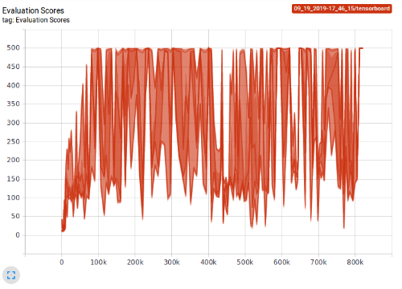

# Deep Q-Network
Cartpole:




## Usage
Training:
```
python dqn.py -env (env_name) -lr (learning_rate)
```

Evaluation:
```
python dqn.py -eval -cp (path/to/checkpoint)
```

## Future Work
- Customizable network structure
- More hyper-parameters can be specified through command line argument
- Apply DQN agent to more environments